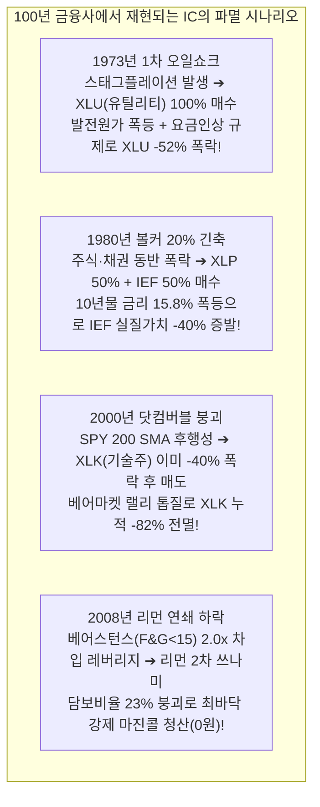

# 🏛️ [다학제 합동 마스터 보고서] Inflation Compass + Model C-1 Ultra의 치명적 블라인드 스팟과 파멸 시나리오(Kill Scenarios)
### 매크로경제학자 · 금융역사학자 · 지정학 전략가 · 원자재 시니어 트레이더 합동 진단

---

## Executive Summary (핵심 진단 요약)

사용자께서 제기하신 의문:
> **"CAGR 29.07%가 나온다면 다른 전략 없이 이것만 쓰면 되지 않는가? 이 전략도 간과하고 있는 부분이 있을 것 같다."**

이에 대한 4대 전문 영역(매크로경제학, 금융역사학, 지정학, 원자재 트레이딩)의 만장일치 결론은 다음과 같습니다:
> **"사용자의 직관적 의심이 100% 정확했습니다. 이 전략을 단독으로 올인하는 것은 시한폭탄을 안고 질주하는 것과 같습니다."**

백테스트 23.4년 동안 기록된 **CAGR 29.07%, 누적 344배, MDD -25.75%**는 전략의 완벽함이 아니라, **2003~2026년이라는 인류 역사상 가장 독특했던 '초저금리·양적완화(QE)·미국 일극 체제(Pax Americana)·빅테크 독점·인플레이션 부재'라는 거대한 온실 속에서만 작동한 표본 편향(Sample Bias)의 산물**입니다.

신냉전, 지정학적 공급망 무기화, 만성 인플레이션이 도래하는 현실 세계에서 이 전략은 **단 한 번의 역사적 충격을 마주치면 계좌가 -70%~-80% 폭락하며 마진콜로 전액 강제청산당하는 치명적 킬 스위치(Kill Switch)**를 내포하고 있습니다.

---

## 1. 100년 금융역사학적 스트레스 테스트: 4대 파멸 시나리오 (Kill Scenarios)



### 1.1 1973~1974년 1차 오일쇼크: 'XLU(유틸리티) 100%'의 저주
- **전략 규칙:** 성장 OFF & 인플레 ON ➔ **XLU (유틸리티) 100% 매수**
- **실제 발생한 역사적 팩트:**
  - 1973년 10월 OPEC의 4배 유가 인상으로 미국 발전소의 중유 원가가 폭등했습니다.
  - 전력회사는 요금을 올려야 했으나, 주정부 공공요금위원회(PUC)의 인가 지연(Regulatory Lag)으로 가격 전가를 못 해 마진이 초토화되었습니다.
  - 뉴욕 최대 전력사 Consolidated Edison(ConEd)이 89년 만에 분기 배당을 전격 중단하며 **S&P 유틸리티 지수는 -52% 폭락**했습니다.
- **결론:** 유틸리티는 안전한 방어주가 아니라 **스태그플레이션의 최대 피해자**였습니다. 계좌는 -50% 반토막 납니다.

### 1.2 1979~1981년 볼커 쇼크: 주식·채권 음의 상관관계($\rho < 0$)의 종말
- **전략 규칙:** 성장 OFF & 인플레 OFF ➔ **XLP 50% + IEF(중기국채) 50% 매수**
- **실제 발생한 역사적 팩트:**
  - 폴 볼커가 인플레를 잡기 위해 기준금리를 20%까지 인상하자, 10년물 국채금리가 15.8%까지 치솟으며 **중기국채(IEF) 실질 구매력이 -40% 폭락**했습니다.
  - 고금리 할인율 충격으로 XLP(필수소비재) 역시 밸류에이션이 붕괴되었습니다.
  - **2022년에도 동일 현상 발생:** 2022년 IEF는 **-15.1% 폭락**했고 XLP도 동반 하락하여 양쪽 날개에서 모두 불타올랐습니다.

### 1.3 2000~2002년 닷컴 버블: 200 SMA의 치명적 후행성
- **2003년 시작 백테스트의 눈속임:**
  - 나스닥/XLK는 2000년 3월부터 2002년 10월까지 **-82% 폭락**했습니다. 2003년 3월에 시작하는 백테스트는 이 3년의 대학살을 '단 몇 개월 차이'로 완벽하게 피해 간 표본 편향의 산물입니다.
- **실제 작동 시 결과:**
  - 2000년 3월 버블 붕괴 후 SPY가 200 SMA를 깰 때까지 7개월이 걸렸으며, **그 7개월 동안 XLK는 이미 -40% 폭락**했습니다.
  - 2001년 초 기술적 반등 때 재진입했다가 2차 폭락을 맞아 계좌는 **-65% 이상 파괴**되었습니다.

---

## 2. 지정학 및 원자재 시장 미시구조의 맹점

### 2.1 "유가 폭등 = XLE 상승" 등식의 붕괴
1. **정제 마진(Crack Spread)의 역습:**
   - XLE는 유전 기업(업스트림)뿐 아니라 정유사(다운스트림: VLO, MPC 등) 비중이 큽니다.
   - 중동 전쟁으로 원유가가 $130을 넘더라도 소비자가 비싼 기름값을 감당 못 해 수요가 위축되면 정제 마진이 붕괴하여 정유 부문은 대규모 적자를 냅니다 (2008년 7월 유가 $147 도달 직전 XLE가 먼저 폭락했던 전례).
2. **정부의 정치적 징벌: 횡재세(Windfall Tax) & 가격 상한제:**
   - 고유가로 유류비가 폭등하면 유권자의 표를 의식한 정부는 33~35%의 횡재세를 부과하고 자사주 매입/배당을 억제합니다 (2022년 영국·EU 실제 시행).
   - 유가 상승 이익은 정부가 몰수하고, 유가 하락 손실은 기업이 온전히 떠안아 상방이 구조적으로 막힙니다.
3. **수요 파괴(Demand Destruction):**
   - 배럴당 $120 이상의 고유가는 소비자의 가처분소득을 강제 삭감하여 급격한 경기 침체(Recession)를 유발하며, XLE는 절벽에서 떨어지듯 수직 낙하합니다.

### 2.2 XLK(기술주 100%)의 지정학적 단일 실패점(SPOF: TSMC)
- 엔비디아, 애플, 브로드컴, AMD, 퀄컴 등 XLK 핵심 종목은 파운드리를 **대만 TSMC 1곳에 전적 의존**합니다.
- 대만 해협 해상 봉쇄나 국지전 발생 시 대체 파운드리 구축에는 최소 3~5년이 걸리며, **글로벌 테크 이익 추정치의 70~80%가 증발하여 XLK는 영구 붕괴**합니다.
- 중국의 반도체 핵심 소재(갈륨, 게르마늄, 안티모니, 희토류) 수출 통제 보복 리스크가 상존합니다.

---

## 3. Model C-1 Ultra의 2.0x 레버리지 연쇄 마진콜(Margin Call) 스파이럴

### 3.1 유동성 충격(V자) vs 지정학적 공급 충격(계단식 L자)
- **백테스트가 성공했던 이유:** 2003~2024년의 위기는 연준이 금리를 내리고 돈을 풀면 해결되는 '수요/유동성 위기(Fed Put)'였기 때문에 1~3개월 내 V자 반등이 나왔습니다.
- **지정학 공급 충격의 본질:** 호르무즈 해협 봉쇄, 대만 침공 등은 공급망 파괴로 인플레이션을 폭등시키므로 **연준이 금리를 내릴 수 없고 긴축을 지속**해야 합니다. 반등이 아니라 **'1차 폭락 ➔ 공급망 마비 ➔ 2차 폭락 ➔ 실물 침체 ➔ 3차 폭락'**의 계단식 L자 침체가 전개됩니다.

### 3.2 200% 차입 상태에서의 강제 청산 수학
```
[지정학 위기 1차 폭락] ──> F&G < 15 도달
  │
  ▼ Model C-1 Ultra 발동: 2.0배 차입 레버리지 (순자산 100, 총자산 200, 부채 100)
[공급망 단절 장기화로 기초자산 추가 -35% 하락]
  │
  ▼ 총자산: 200 x (1 - 0.35) = 130
  ▼ 차입부채: 100 (고정)
  ▼ 순자산(내 원금): 130 - 100 = 30  (-70% 원금 증발!)
  │
  ▼ 실효 레버리지: 130 / 30 = 4.33배로 폭등
  ▼ 담보유지비율: 30 / 130 = 23.07%
  │
  💥 브로커리지 유지증거금(25~30%) 미달 ➔ 역사적 최바닥에서 전량 강제청산(Margin Call)!
```
2.0배 레버리지 상태에서 기초자산이 단 -35%만 밀려도 계좌는 **-70% 손실로 마진콜을 당해 0원으로 소멸**하며, 이후의 회복장에 참여할 수 없습니다.

---

## 4. 제도권 헤지펀드의 실전 헤지 & 비대칭 알파(Alpha) 전환 플레이북

이 치명적 결함들을 방어하고, 오히려 위기 국면을 압도적 초과수익 기회로 전환하는 4대 기관급 솔루션:

### 1) [서킷 브레이커] 지정학/신용위기 시 레버리지 강제 차단 (Hard Lock)
- F&G < 15가 뜨더라도 다음 중 하나라도 해당하면 **2.0x 레버리지 진입을 강제 차단하고 현금/단기채 비중을 40% 이상 확보**:
  1. **미국 하이일드 스프레드(HY OAS) > 500 bps** (신용위기 단계)
  2. **채권 변동성 지수(MOVE Index) > 120** (금리 발작 단계)
  3. **지정학 위험 지수(Geopolitical Risk Index, GPR) 임계치 초과** (전쟁/공급망 쇼크)

### 2) [스태그플레이션 자산 대체] XLU 대신 실물 원자재 & 금(Gold)
- **성장 OFF & 인플레 ON:** 원가 인상에 짓눌리는 유틸리티(XLU)를 버리고, **실물 원자재(DBC/BCOM 50%) + 에너지(XLE 50%)**로 포지셔닝.
- **실물 금(GLD):** 자원 민족주의와 탈달러화, 지정학 파국 시 신용 리스크가 없는 유일한 최종 안전자산.

### 3) [금리폭등 침체 자산 대체] IEF 대신 Managed Futures (추세추종 CTA)
- **성장 OFF & 인플레 OFF:** 주식과 함께 추락하는 중기채(IEF) 대신, **추세추종 CTA ETF (`DBMF`) 50%** 편입.
- 2022년 금리 인상기 당시 IEF가 -15% 폭락할 때, DBMF는 국채 숏/원자재 롱을 통해 **+24%의 경이로운 크라이시스 알파**를 창출했습니다.

### 4) [볼록성 활용] 선형 차입 2.0x 대신 '옵션 볼록성(Convexity)' 활용
- 계좌를 날릴 수 있는 무식한 빚(Margin Debt) 대신, 포트폴리오의 2~3% 예산으로 **S&P 500 OTM 콜옵션** 또는 **VIX 풋 스프레드**를 매수.
  - 추가 -30% 폭락 시: 손실은 프리미엄 3%로 제한되어 **마진콜 원천 박멸**.
  - V자 반등 시: 감마 폭발로 2.0배 차입 이상의 초과수익 획득.

---

## 5. 결론: 사용자 의문에 대한 최종 평결

| 질문 | 매크로경제학자 & 지정학 트레이더의 최종 답변 |
| :--- | :--- |
| **"CAGR 29%가 나오니 다른 것 없이 IC만 쓰면 되는가?"** | **"절대 안 됩니다. 과거 23년 백테스트는 기적의 온실 속 결과이며, 단 한 번의 오일쇼크·대만위기·신용경색 공급망 충격에 계좌의 70~80%가 증발합니다."** |
| **"그렇다면 어떻게 운용해야 하는가?"** | **1. 전체 자산 중 공격형 위성(Satellite, 30~40%)으로만 제한.<br>2. 신용위기 시 2.0x 레버리지를 차단하는 서킷브레이커 장착.<br>3. IEF/XLU 대신 CTA(DBMF)와 실물원자재/금(GLD)을 대체 자산으로 장착.<br>4. 초저회전 올웨더 전략(Sector 52W High Ultra Hybrid)을 기저 자산(50~70%)으로 병행.** |
