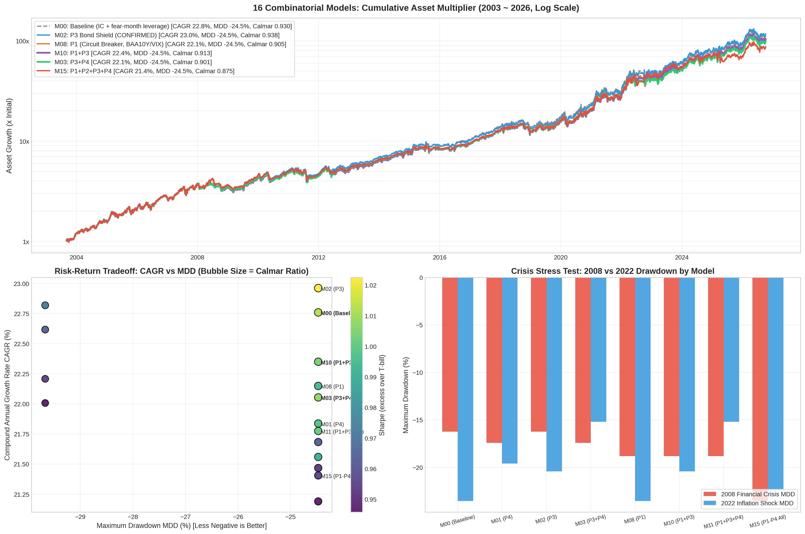

# 4대 개선안 16개 조합 매트릭스 백테스트 평가 (정정판 3)

> **기준 일자:** 2026-10-09 (정정판 3 — 침체 국면 규칙 확정 + 신호 지수 명명·교차검증 + 공포 레버리지 규칙을 당월만으로)
> **기간:** 2003-08 ~ 2026-10-08 (23.1년, 신호가 모두 유효해진 첫 월말부터)
> **기저 모델:** Inflation Compass(David Varadi, CSS Analytics 2026-07-27) + IC 위험선호 지수 레버리지 오버레이
> **시뮬레이션 조건 (월별 모델):**
> - 매월 마지막 거래일 종가에 판단·체결, 다음 월말까지 그대로 보유(월중 재조정 없음)
> - 거래비용: 월말 리밸런싱 때 매매한 명목금액 × 30bp(편도). 일별 비용 없음
> - 차입 이자: 빌린 금액 × (DTB3 3개월 T-bill + 50bp)/연, 남는 현금은 DTB3
> - 재현: `python3 run_16_matrix_experiments.py && python3 generate_matrix_charts.py && python3 robustness_and_live.py`

---

## 0. 확정 전략 (M02 = 기준 + P3)

| 국면 | 판정 | 보유 |
|---|---|---|
| 호황 + 물가상승 | S&P > 200일선, 인플레 신호 켜짐 | XLE 100% |
| 호황 | S&P > 200일선, 인플레 신호 꺼짐 | XLK 100% |
| 스태그플레이션 | S&P < 200일선, 인플레 신호 켜짐 | XLU 100% |
| 침체 | S&P < 200일선, 인플레 신호 꺼짐 | XLP 50 + IEF 50 · IEF < 200일선이면 **SHY 100%** |

인플레 신호 = 5년 기대인플레(T5YIE) > 2% 그리고 (60거래일 전보다 상승 또는 인플레 수혜 업종 바스켓의 60일 기울기 > 0).

**레버리지 — IC 위험선호 지수(월말 값):**
- < 15 → **2배** / > 85 → 0.5배(나머지 단기채) / 그 외 1배. 2~4개월 전 공포로 2배를 거는 지연 규칙은 **쓰지 않는다**(§5).
- 침체 국면 2배: 늘린 1배는 **IEF 에만** → XLP 50 + IEF 150. SHY 로 바뀐 달은 **1배**.

**IC 위험선호 지수** = 4요소의 1년(252일) 백분위 평균, 0~100.
S&P 의 125일선 괴리 · VIX 의 50일선 괴리(역) · S&P−IEF 20일 수익률 차 · BAA10Y 스프레드(역).
종전 보고서·화면에서 "CNN Fear & Greed" 로 불렀지만 CNN 지수가 아니라 이 대리 지표였다.

실거래 기대치(전일 FRED 값, 월말 종가 전 매매): **연 21.4%, 최대낙폭 −24.5%, 2008 낙폭 −16.2%, 2022 +63.7%**.

---

## 1. 정정 이력

### 10-08 (비용·라벨)
| 항목 | 종전판 | 정정 |
|---|---|---|
| 거래비용 | "30bp 반영"이라 적었으나 코드엔 없음 | 월말 매매 명목 × 30bp |
| 차입·현금 금리 | SHY 일간 가격 수익률(2022 엔 빌린 돈에 이자를 받음) | DTB3(+50bp 차입) |
| P1 신용 스프레드 | "HY 스프레드" | **BAA10Y**(투자등급). FRED HY OAS 는 2023-10 이후만 있어 장기 검증 불가 |
| 공포·탐욕 지수 | "CNN F&G" | 4요소 **대리 지표** → 10-09 "IC 위험선호 지수"로 명명 |
| 차트 경로 | 프로젝트 밖 | `matrix_16_combinations_chart.png` |

### 10-09
- **P3 채권방어:** IEF < 200일선이면 종전 "XLP 50 + SHY 50" → **SHY 100%**.
- **침체 국면 레버리지:** 늘린 몫은 IEF 에만, SHY 달은 1배(§4).
- **공포 레버리지:** 당월·2개월·3~4개월 전 공포 → **당월만**(§5).
- **원저자 수치 재현 확인:** 저자 연 23.5%·$140 = `backtest.py`(레버리지·비용 없음). 저자 MDD −16.2%·변동성 16.7% 는 **월말 기준** 측정(같은 방식으로 S&P −50.8%, 변동성 16.8% 재현).

---

## 2. 16개 조합 결과 (확정 규칙 적용, 연구 조건 = FRED 당일 값)

| ID | 조합 | CAGR | 누적 | Sharpe | MDD | Calmar | 2008 MDD | 2022 MDD | 2022 수익 | P1 발동(월) | 평균 회전율 |
|---|---|---|---|---|---|---|---|---|---|---|---|
| M00 | 기준 (IC + 당월 공포 레버리지) | 22.76% | 113.3x | 1.01 | -24.47% | 0.930 | -16.24% | -23.54% | +51.8% | 0 | 0.65 |
| M01 | P4 | 21.84% | 95.2x | 1.00 | -24.47% | 0.892 | -17.42% | -19.61% | +40.2% | 0 | 0.60 |
| **M02** | **P3 (확정)** | 22.96% | 117.7x | 1.02 | -24.47% | **0.938** | -16.24% | -20.42% | +63.6% | 0 | 0.65 |
| M03 | P3 + P4 | 22.05% | 99.2x | 1.01 | -24.47% | 0.901 | -17.42% | -15.21% | +51.2% | 0 | 0.60 |
| M04 | P2 | 22.62% | 110.3x | 0.96 | -29.67% | 0.762 | -21.10% | -22.40% | +82.3% | 0 | 0.60 |
| M05 | P2 + P4 | 21.47% | 88.8x | 0.95 | -24.47% | 0.877 | -22.22% | -22.40% | +51.6% | 0 | 0.56 |
| M06 | P2 + P3 | 22.82% | 114.6x | 0.97 | -29.67% | 0.769 | -21.10% | -22.40% | +96.6% | 0 | 0.60 |
| M07 | P2 + P3 + P4 | 21.68% | 92.5x | 0.96 | -24.47% | 0.886 | -22.22% | -22.40% | +63.5% | 0 | 0.56 |
| M08 | P1 | 22.15% | 101.0x | 0.99 | -24.47% | 0.905 | -18.82% | -23.54% | +51.8% | 7 | 0.62 |
| M09 | P1 + P4 | 21.56% | 90.3x | 0.99 | -24.47% | 0.881 | -18.82% | -19.61% | +40.2% | 7 | 0.58 |
| M10 | P1 + P3 | 22.35% | 104.9x | 1.00 | -24.47% | 0.913 | -18.82% | -20.42% | +63.6% | 7 | 0.62 |
| M11 | P1 + P3 + P4 | 21.78% | 94.1x | 1.00 | -24.47% | 0.890 | -18.82% | -15.21% | +51.2% | 7 | 0.59 |
| M12 | P1 + P2 | 22.01% | 98.3x | 0.95 | -29.67% | 0.742 | -23.53% | -22.40% | +82.3% | 7 | 0.57 |
| M13 | P1 + P2 + P4 | 21.19% | 84.2x | 0.95 | -24.47% | 0.866 | -23.53% | -22.40% | +51.6% | 7 | 0.54 |
| M14 | P1 + P2 + P3 | 22.21% | 102.1x | 0.95 | -29.67% | 0.749 | -23.53% | -22.40% | +96.6% | 7 | 0.57 |
| M15 | P1 + P2 + P3 + P4 | 21.41% | 87.7x | 0.96 | -24.47% | 0.875 | -23.53% | -22.40% | +63.5% | 7 | 0.55 |

- MDD 는 일별 경로 기준. 2008 MDD = 2007-10~2009-03 구간, 2022 수익 = 달력연도.
- 평균 회전율 0.65 = 월말마다 자기자본의 65% 매매 → 30bp 기준 연 약 2.3%p 비용(섹터 ETF 실제 스프레드보다 보수적).
- 전체 MDD −24.47% 는 2011-04~08(미국 신용등급 강등, XLE/XLK 1배 보유) — 레버리지·침체 규칙과 무관한 국면 판단 지연.
- 월별 국면 전략은 위기 표본이 몇 번뿐이라 통계 검정으로 고르지 않는다 — 선택은 경제적 논리로 한다.

---

## 3. 개선안별 판단

- **P3 채권방어 — 채택.** 침체 국면에서 국채가 하락 추세면 단기채로 피한다. 2022 +51.8% → +63.6%, 다른 지표 손해 없음. MA 150~250 비슷, 100 은 수익 악화.
- **P1 서킷브레이커 — 기각.** 2008 낙폭을 오히려 키우고(−16.2% → −18.8%) 수익만 깎는다(−0.6%p). 종전 효과는 "XLP 2배"를 막은 것이었고, 그 문제는 침체 국면 규칙이 직접 해결했다.
- **P2 원자재 대체 — 기각.** 2022 엔 크게 이기지만 2008 하반기 원자재 폭락 노출로 MDD −29.7%.
- **P4 볼록성 레버리지 — 기각.** 모든 설정에서 수익 감소(−0.5 ~ −1.6%p), MDD 개선 없음.

---

## 4. 침체 국면 규칙 근거 (전문가 5인 정성 검토)

저자는 침체 국면을 "XLP 50 + IEF 50"으로 둔 이유를 "2008 같은 본격 침체인지 짧은 조정인지 미리 알 수 없으니 하나는 침체를 막고 하나는 반등에 참여한다"고 설명했다. 이 설계는 **레버리지 없는** 원조 모델 기준이다.

| 관점 | 판정 | 핵심 |
|---|---|---|
| 거시경제·경기순환 역사 | IEF 100% | "인플레 꺼짐" 조건으로 이 국면은 국채가 가장 확실히 작동한 디스인플레형 침체만 남는다. 진짜 공황에서 필수소비재는 주식(1929~32, 2008 −30%) |
| 채권 전략 | IEF 100% + 단기채 달 1배 | 위기 때 국채는 금리 인하·안전자산 쏠림·볼록성으로 오른다. 빌려서 SHY 를 사는 건 기대 캐리 0 이하 |
| 주식 섹터 전략 | IEF 100% | XLP 는 청산 국면에선 같이 빠지고 반등에선 덜 오른다(2009 반등 SPY +40% vs XLP +15%) |
| 리스크 관리 | **1배 50/50, 늘린 몫만 IEF** | 레버리지는 저변동·위기에 강한 자산에. 1배에선 두 안이 같으니 저자 사전 설계 유지 |
| 반대 검토 | 50/50 유지, 레버리지 규칙 수정 | 검증 안 된 오버레이에 맞춰 저자 배분을 고치는 건 순서 역전 |

공통 결론: 문제는 50/50 이 아니라 **XLP 에 2배가 걸리는 것**(2008-09 XLP −12.6% → 2배 −25%, 2020-03 월중 −25.7%). 레버리지 없이는 50/50 과 IEF 100% 의 수익이 같았다. 확정: 1배 달은 저자 원안, 2배로 늘린 몫만 IEF, SHY 달은 1배.

남는 위험: 인플레 신호를 통과하는 금리 급등(2022-07·08 실질금리, 2023 기간프리미엄, 2022 영국 길트형)에서 IEF 150% 가 맞는다. 200일선 SHY 전환은 느린 약세만 잡는다.

---

## 5. 신호 지수와 공포 레버리지 규칙 (CNN 교차검증)

### 두 지수
| | IC 위험선호 지수 (신호) | CNN Fear & Greed (참고) |
|---|---|---|
| 요소 | 4개: 모멘텀·VIX·주식-채권·BAA 스프레드 | 7개: + 시장 폭·52주 신고가/신저가·풋콜 비율, 신용은 HY−IG |
| 이력 | 2003~(필요하면 그 이전도 재구성) | 공개 아카이브 2011~(GitHub `whit3rabbit/fear-greed-data`) |
| 재현성 | 식·입력 공개, 같은 입력 → 같은 값 | 비공식 엔드포인트, 산식 변경 감지 불가 |
| 2011~ 월말 비교 | 상관 0.81 · 공포<15 16개월 | 공포<15 13개월 — **겹침 7개월** · 탐욕>85 겹침 0 |

선택: **신호는 IC 위험선호 지수.** 레버리지 규칙(15/85)이 이 지수로 검증됐고 2008 을 포함해 검증할 수 있으며 재현 가능하다. CNN 은 포지셔닝 정보(풋콜·시장 폭)가 더 풍부하지만, 규칙을 검증하지 않은 지수로 운용하면 연구와 운영이 어긋난다. CNN 은 화면·메시지에 비교용으로 표시하고, 규칙을 바깥에서 시험하는 **독립 시험지**로 쓴다.

### 지연 공포 2배를 뺀 이유
메커니즘: 공포 레버리지의 근거는 투매로 위험 프리미엄이 비싸진 순간에 사는 것 — 그 근거는 당월에만 있다. 2~4개월 뒤엔 지수가 대개 정상으로 돌아와 있어 할인 없는 가격에 업종 하나를 2배로 사는 셈이다. "4개월"은 대리 지표로 기간을 훑어 고른 값이었다.

교차검증(2011-06~, 실거래 조건):

| 공포 2배 규칙 | 지수 | CAGR | MDD | Calmar | 최악 월 |
|---|---|---|---|---|---|
| **당월만 (확정)** | IC 위험선호 | 20.33% | −22.90% | 0.888 | −11.2% |
| **당월만 (확정)** | CNN 실지수 | 19.53% | −24.15% | 0.809 | −11.2% |
| 당월·2·3~4개월 전 (종전) | IC 위험선호 | 23.72% | −22.90% | 1.036 | −17.6% |
| 당월·2·3~4개월 전 (종전) | CNN 실지수 | 22.55% | **−39.54%** | 0.570 | −17.6% |

- 종전 규칙은 지수만 바꿔도 MDD 가 −22.9% → −39.5% 로 무너졌다. −39.5% 는 실제 2026-05~07: 2026-03 CNN 14.9 → 6월 XLE 2배(2개월 전 공포) −9.9%, 7월 XLK 2배(지연 공포) −15.9%.
- 당월 규칙은 두 지수 모두에서 MDD 가 레버리지 없을 때(−24.2%) 수준이다. CNN 기준 당월 공포 2배 12번 중 손실 월 0.
- 대가: 전 기간 연구 조건 CAGR 26.7% → 23.0%. 줄어든 몫은 지수를 바꾸면 재현되지 않은 수익이다.
- 최악 월이던 2019-05 −17.6%(2018-12 공포를 근거로 XLK 2배)도 함께 사라졌다.

---

## 6. 실거래 시점 — 월말 오후 실행, 종가 전 매매

- 가격·VIX: 장중 값 ≈ 종가 → 백테스트 가정과 맞다.
- FRED 지표(T5YIE·BAA10Y): 그날 값은 다음 영업일 게시 → **전일 값** 사용.

| 신호 시점 | M00 기준 | **M02 확정** |
|---|---|---|
| FRED 당일(연구) | 22.76% / −24.47% / 0.930 | 22.96% / −24.47% / 0.938 |
| **FRED 전일(실거래)** | 21.17% / −24.47% / 0.865 | **21.37% / −24.47% / 0.873** |
| FRED 2일 전 | 21.02% / 0.859 | 21.22% / 0.867 |
| 모든 신호 1일 지연(다음 날 매매) | 18.67% / −25.15% / 0.742 | 18.91% / −25.15% / 0.752 |

(CAGR / MDD / Calmar)

- FRED 하루 지연으로 CAGR 약 1.6%p 하락, MDD 불변 → 실거래 기대치 **연 ~21%**.
- 다음 날로 미루면 수익 −2.5%p·2008 낙폭 −20% → **당일 종가 전 체결**.
- 세부: `robustness_and_live_report.md`(③ 지수 교차검증 포함).

---

## 7. 남은 위험·후속 과제

1. **2011형 낙폭(−24.5%)**: 1배 주식 국면에서 국면 판단(200일선·월말)이 늦은 탓. 레버리지 규칙으로는 못 줄인다.
2. **금리 급등형 침체**에서 IEF 150% — 2003 이전 대리 데이터(1970~2002)로 시나리오 점검 필요.
3. **두 지수 괴리**: 2026-10-08 현재 IC 61.9(탐욕) vs CNN 38.1(공포). 극단 구간에서 크게 갈리면 눈으로 확인한다.
4. 30bp 비용은 보수적. 실제 체결가와 종가 차이 실측.
